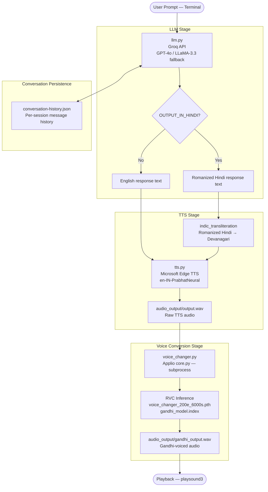

# Gandhigiri AI

**Gandhigiri AI** is a terminal-based, voice-interactive conversational system that simulates a dialogue with Mahatma Gandhi. The system accepts natural-language prompts from the user, generates philosophically grounded responses via a large language model instructed to embody Gandhi's rhetorical style, converts that text into speech, and subsequently applies a custom-trained Retrieval-based Voice Conversion (RVC) model to render the final audio in a synthesized approximation of Gandhi's voice. The project is intended for individuals interested at the intersection of cultural preservation, generative AI, and voice cloning — offering a novel medium for engaging with Gandhian thought through interactive oral dialogue.

---

## Architecture Overview

The system is composed of four discrete, sequentially dependent stages. Each stage is encapsulated in its own module within the `scripts/` directory and communicates with the next via file paths or in-memory Python objects.



### Key Components

| Component                              | Module                     | External Dependency             |
| -------------------------------------- | -------------------------- | ------------------------------- |
| LLM orchestration & session management | `scripts/llm.py`           | Groq Cloud API                  |
| Text-to-speech synthesis               | `scripts/tts.py`           | Microsoft Edge TTS (`edge-tts`) |
| Romanized Hindi transliteration        | `scripts/tts.py`           | `indic-transliteration`         |
| Voice conversion (RVC inference)       | `scripts/voice_changer.py` | Applio (Git submodule)          |
| Training data extraction               | `scripts/extractor.py`     | `pyannote.audio`, `pydub`       |
| Audio playback                         | `scripts/main.py`          | `playsound3`                    |
| RVC model & FAISS index                | `models/`                  | Trained externally via Applio   |

---

## Core Design Decisions

### 1. Subprocess Isolation for RVC Inference

The Applio voice conversion engine is invoked via `subprocess` rather than imported as a Python library. This is a deliberate architectural boundary: Applio maintains its own virtual environment with dependencies that are incompatible with the project's Python 3.12 environment. The isolation prevents dependency conflicts without requiring containerisation, at the cost of inter-process communication overhead on each inference call.

### 2. Two-Stage Audio Synthesis (TTS → RVC)

The system does not attempt end-to-end voice generation directly from text. Instead, it uses a neutral Indian-accented male voice (`en-IN-PrabhatNeural`) as a phonetic scaffold for the RVC model. This design choice improves RVC output quality: the source voice's cadence and articulation characteristics (slowed rate at `-10%`, lowered pitch at `-5Hz`) are tuned to approximate Gandhi's measured speech rhythm, giving the downstream RVC model higher-quality input to convert.

### 3. Persistent, Numbered Conversation Sessions

Conversation history is serialised to `conversation-history.json` at the conclusion of each session. Upon subsequent launches, the user may resume any prior numbered session or begin a new one. Each session record carries the model name, language setting, creation timestamp, and the full message history including the system prompt. This enables multi-session continuity without a database dependency.

### 4. Primary / Backup Model Fallback

The LLM layer is configured with two distinct model identifiers — a primary and a backup. Should the primary model invocation fail (e.g., rate limit, service unavailability), `llm.py` automatically retries the identical prompt against the backup model. Both models are served through the Groq inference API, meaning no code path change is required between them.

---

## Getting Started

### Prerequisites

- Python 3.12 (enforced via `.python-version`)
- [`uv`](https://docs.astral.sh/uv/) package manager
- A [Groq API key](https://console.groq.com/)
- A [Hugging Face token](https://huggingface.co/settings/tokens) (required only for training data extraction via `extractor.py`)
- Git (with submodule support)

### Installation

**1. Clone the repository with its submodule**

```bash
git clone --recurse-submodules https://github.com/sadmanhsakib/gandhigiri-ai.git
cd gandhigiri-ai
```

If the repository was cloned without `--recurse-submodules`:

```bash
git submodule update --init --recursive
```

**2. Create and activate the virtual environment**

```bash
uv sync
```

**3. Configure environment variables**

```bash
cp example.env .env
```

Open `.env` and populate the required values. Refer to the [Configuration Reference](#configuration-reference) section below.

**4. Model training**

**See the [Model Training Guide](TRAINING.md) for detailed instructions. The trained model artifacts (`.pth` and `.index` files) must be placed in the `models/` directory before the system can perform voice conversion.**

**5. Run the application**

```bash
uv run scripts/main.py
```

On first launch, `voice_changer.py` will automatically download Applio's prerequisite model files (pitch estimators) if they are not already present.

---

## Configuration Reference

All runtime configuration is provided via a `.env` file at the project root. Copy `example.env` to `.env` and populate the values.

| Variable             | Required            | Default                   | Description                                                                                                                                   |
| -------------------- | ------------------- | ------------------------- | --------------------------------------------------------------------------------------------------------------------------------------------- |
| `GROQ_API_KEY`       | **Yes**             | —                         | API key for the Groq inference service.                                                                                                       |
| `PRIMARY_MODEL_NAME` | **Yes**             | `openai/gpt-oss-120b`     | Groq-compatible model identifier used for primary LLM inference.                                                                              |
| `BACKUP_MODEL_NAME`  | **Yes**             | `llama-3.3-70b-versatile` | Fallback model identifier invoked automatically if the primary model fails.                                                                   |
| `HF_TOKEN`           | Only for extraction | —                         | Hugging Face access token, required by `pyannote/speaker-diarization-3.1` during training data extraction. Not needed for conversational use. |
| `OUTPUT_IN_HINDI`    | No                  | `0`                       | Set to `1` to instruct the LLM to respond in Romanized Hindi. Set to `0` for English output.                                                  |

### Voice Conversion Parameters

The following constants in `scripts/voice_changer.py` govern the RVC inference behaviour and may be adjusted without retraining the model:

| Constant               | Default | Description                                                                                                                         |
| ---------------------- | ------- | ----------------------------------------------------------------------------------------------------------------------------------- |
| `PITCH_SHIFT`          | `0`     | Semitone shift applied to the converted voice. Values between `-4` and `+4` are practical. Use `tune_pitch()` to audition variants. |
| `INDEX_INFLUENCE`      | `0.66`  | Weight of the FAISS index in voice timbre retrieval. Higher values produce a stronger resemblance to the training voice.            |
| `CONSONANT_PROTECTION` | `0.33`  | Fraction of consonant energy protected from pitch conversion distortion.                                                            |
| `PITCH_METHOD`         | `rmvpe` | Fundamental frequency estimation algorithm. Options: `rmvpe`, `fcpe`, `hybrid[rmvpe+fcpe]`.                                         |
| `CLEAN_AUDIO`          | `True`  | Enables post-processing noise reduction on the RVC output.                                                                          |
| `CLEAN_STRENGTH`       | `0.5`   | Strength of the noise reduction filter (`0.0`–`1.0`).                                                                               |

---

## Known Limitations

- **Latency.** Each turn incurs three sequential blocking operations: a remote LLM API call, an Edge TTS network request, and an RVC subprocess invocation. On commodity hardware, end-to-end response latency per turn typically ranges from several seconds to over ten seconds depending on network conditions and model inference time.

- **No streaming.** The LLM response is consumed in full before TTS begins; there is no sentence-level streaming or interruptibility. The user must wait for the entire pipeline to complete before audio playback commences.

- **Single-user, local-only.** The system is designed exclusively for single-session, local terminal use. There is no web interface, API server, or multi-user capability.

- **Voice model quality is training-data dependent.** The quality of the Gandhi voice simulation is directly constrained by the quantity and acoustic clarity of the training audio used to build the RVC model. Insufficient or noisy training data will produce artefacts in the converted audio.

- **Windows path assumptions in voice conversion.** The `voice_changer.py` module constructs the Python executable path assuming a `.venv/Scripts/python.exe` structure (Windows) or `.venv/bin/python` (POSIX). Environments with non-standard virtual environment layouts will require manual path adjustment.
